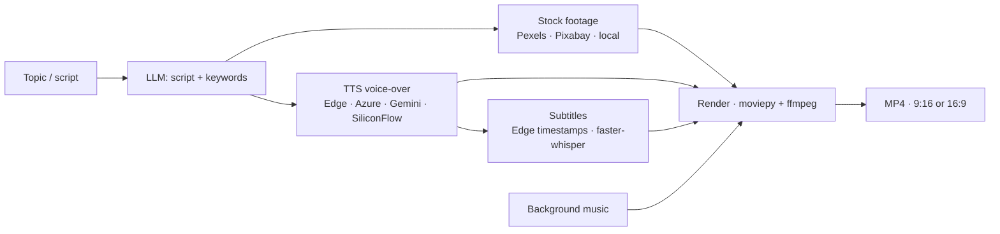

# AZIRAL Video Generator 🎬

<p align="center">
  <a href="https://github.com/azirali/aziral-video-gen/actions/workflows/ci.yml"></a>
  <a href="https://github.com/azirali/aziral-video-gen/actions/workflows/deploy-hf.yml"></a>
  
  
  
  
</p>

Automated short-video pipeline for marketing content: give it a **topic or a
script** and it produces a finished vertical/horizontal video — LLM-written
copy, stock footage, TTS voice-over, burned-in subtitles and background music.

**Live demo:** https://huggingface.co/spaces/shutovBro/aziral-video-gen
*(free CPU Space — a 30-second clip takes a few minutes to render)*

Built on the MIT-licensed [MoneyPrinterTurbo](https://github.com/harry0703/MoneyPrinterTurbo)
engine (see [docs/upstream](docs/upstream) for the original documentation);
this repository adds the AZIRAL deployment layer: production Docker/compose
setup, CI, one-command Hugging Face deployment and config bootstrapping from
environment variables.

## Pipeline



Two entry points share the same services: a **Streamlit UI** (`webui/`) for
people and a **FastAPI service** (`app/`, `/docs`) for automation — tasks can
be queued through Redis and polled or downloaded over HTTP.

## Quick start

```bash
# Docker (recommended)
cp config.example.toml config.toml   # add LLM + Pexels keys
docker compose up -d                 # UI on http://localhost:8501

# Local
uv sync                              # or: pip install -r requirements.txt
streamlit run webui/Main.py          # UI
python main.py                       # API, docs on http://localhost:8080/docs
```

`config.example.toml` documents every option. The keyless `pollinations`
provider works out of the box for the LLM; a free [Pexels API key](https://www.pexels.com/api/)
is needed for footage.

## Deployment

| Target | How |
|---|---|
| Hugging Face Space (demo) | `.github/workflows/deploy-hf.yml` mirrors `main` into a Docker Space; keys are Space secrets read by `deploy/huggingface/bootstrap_config.py` |
| Own server | `.github/workflows/deploy.yml` — SSH + `docker compose up -d --build` (enable with the `SSH_DEPLOY_ENABLED` variable) |
| GPU box | `docker-compose.gpu.yml` / `Dockerfile.gpu`, see [docs/GPU_DOCKER_DEPLOYMENT.md](docs/GPU_DOCKER_DEPLOYMENT.md) |

## Stack

Python 3.11 · FastAPI · Streamlit · moviepy 2 · ffmpeg · ImageMagick ·
faster-whisper · edge-tts · LiteLLM (OpenAI, Gemini, DeepSeek, Qwen, Grok,
Ollama, …) · Redis · Docker

## License

MIT — see [LICENSE](LICENSE). Upstream engine © harry0703 and contributors.
